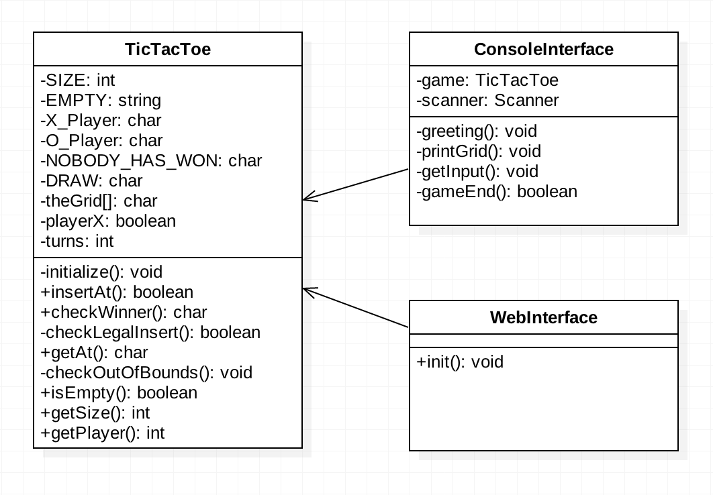

# Design Report
> This report describes the design behind the *setup* and *execution* for the game Tic Tac Toe.

## System Testing
| Test Number | Test Description | Expected output | Errors/Comments |
|:-----------:|------------------|-----------------|-----------------|
|         1.1 | Choose to play on a web browser when asked by the terminal | The game is started in a web browser | |
|         1.2 | Choose to play the game in a terminal when asked by the terminal. | The game is started in a terminal | |
|           2 | Check a box as player 1 and make sure the turn switches to player 2 | A box should be checked and the turn switches to player 2 | |
|           3 | Check three boxes in a horizontal, vertical or diagonal row | As soon as a user gets three boxes in a row the application notifies the player that he has won. | |
|           4 | Produce a draw on the board | The application notifies the users that the result is a draw. | |
|           5 | Finish a game of Tic Tac Toe and reset the table. | The grid will be cleared and reset and players can play again. ||
|           6 | Start a new game of Tic Tac Toe and make sure it's Player X's turn.| A new game will be started and it's now Player X's turn.| ||
### System Testing Results
No errors came up during the test. We feel no need to redo the test in any way at this point. 

### Requirements list

1. Users should be able to choose whether they want to play the game via console or via web.
2. Users should not be able to check more than one box each turn.
3. When a user has successfully checked 3 boxes in a row he should be notified that he is the victor.
4. Users should be notified if there is a draw.
5. Users should be able to reset the Tic tac toe grid as often as they want if they are playing via web.
6. Player X should always make the first move in a new game.

## Class Diagram

